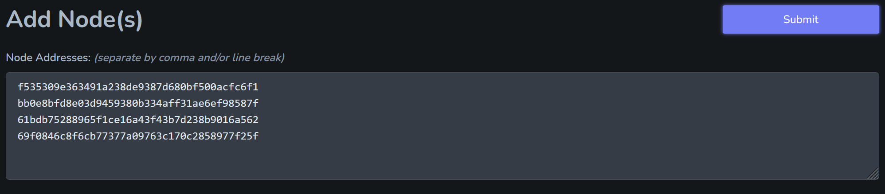

# Add/Remove Nodes

## Add Nodes

Click "Add Nodes"

<figure><figcaption></figcaption></figure>

Paste in POKT node addresses that have the same top level domain as your account.

<figure><figcaption></figcaption></figure>

## Remove Nodes

Select the nodes you with to remove, the click "Delete Nodes"

<figure><figcaption></figcaption></figure>


_Once a node is deleted from CC, that same node can not be added back for 24 hours._&#x20;


